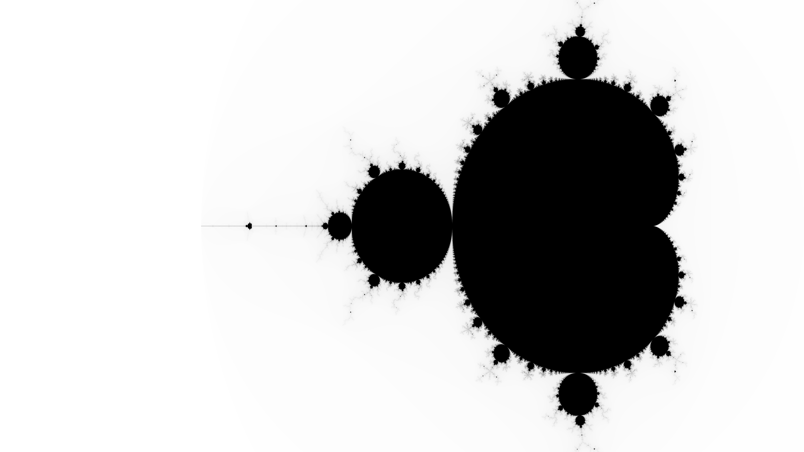
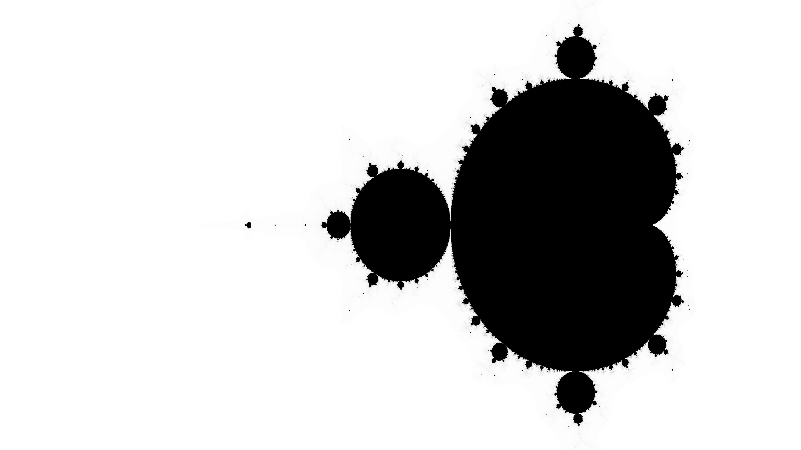

# Mandelbrot
## About

This application renders an image with any given resolution (which does not exceed 2<sup>32</sup> - 1).
It saves rendered bytes to a Luma PNG file named "mandelbrot.png".
Needed parameters: width, height, minimum remaining memory (minimum: 1GB), number threads to use, number of iterations.  
I was inspired by ideas from the book **["Programming Rust: Fast, Safe Systems Development"](https://www.amazon.com/Programming-Rust-Fast-Systems-Development/dp/1492052590)**.

## Build

```shell
cargo build --release
```

## Usage

640x480 pixels image, 1GB of minimum remaining memory, 1 thread, 100 iterations

### On Windows

```shell
cd target\release
.\mandelbrot.exe 640 480 1 1 100
```

### On Linux

```shell
cd target/release
mandelbrot 640 480 1 1 100
```

## Renders

### 8000x6000, 1000 iterations, color

[](resources/mb_color.png)

### 8k resolution, 300 iterations

[](resources/mb_8k_300.png)

### 8k resolution, 1000 iterations

[](resources/mb_8k_1000.png)

### 16k resolution, 10000 iterations

[](resources/mb_16k_10000.png)

## Dependencies

**[crossbeam](https://crates.io/crates/crossbeam/0.8.1)**  
**[png](https://crates.io/crates/png/0.17.5)**  
**[sysinfo](https://crates.io/crates/sysinfo/0.23.10)**

## License

[Mandelbrot](https://github.com/ivan0sokin/mandelbrot) is licensed under the [MIT license](LICENSE)